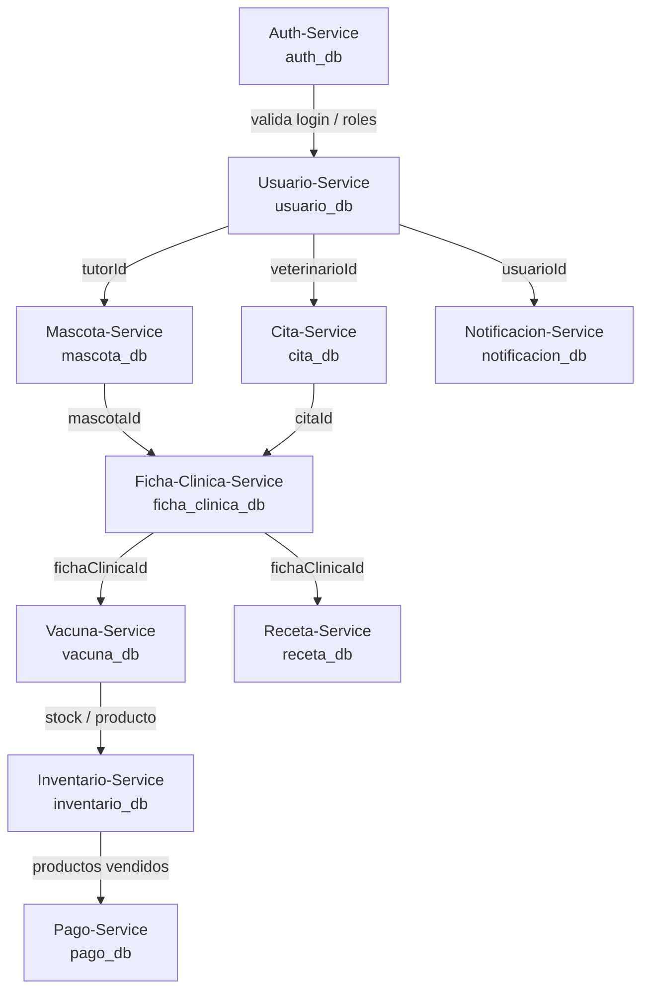

# PGVet

Plataforma de Gestión Veterinaria (PGVet) desarrollada como **monorepo de microservicios** con Java y Spring Boot. Cada servicio tiene su propia base de datos MySQL y se despliega con Docker Compose.

**Integrante:** Hanael Echeverria

---

## Descripción del proyecto

PGVet permite gestionar información veterinaria de forma distribuida: usuarios, mascotas, citas, fichas clínicas, vacunas, recetas, inventario, pagos y notificaciones. La comunicación entre servicios se realiza por API REST; los servicios que necesitan validar datos de otro microservicio usan **OpenFeign** sin acceder a la base de datos ajena.

---

## Tecnologías utilizadas

| Tecnología | Uso en el proyecto |
|------------|-------------------|
| Java 21 | Lenguaje principal |
| Spring Boot 4 | Framework de cada microservicio |
| Spring Web | API REST (controllers) |
| Spring Data JPA | Persistencia con MySQL |
| Validation | Validación de DTOs de entrada |
| Lombok | Reducir código repetitivo en entidades y DTOs |
| MySQL 8 | Base de datos por microservicio |
| Docker Compose | Orquestación de contenedores en desarrollo |
| OpenFeign | Llamadas HTTP entre microservicios |
| SLF4J | Registro de logs en capa service |
| Postman | Pruebas manuales de APIs e integración |

---

## Estructura del repositorio

```
PGVET-FULLSTACK-GRUPO-5/
├── docker-compose.yml          # 20 contenedores (10 MySQL + 10 servicios)
├── codigo-fuente/
│   ├── auth-service/
│   ├── usuario-service/
│   ├── mascota-service/
│   ├── cita-service/
│   ├── ficha-clinica-service/
│   ├── vacuna-service/
│   ├── receta-service/
│   ├── inventario-service/
│   ├── pago-service/
│   └── notificacion-service/
└── README.md
```

> **Nota:** La mayoría de servicios tienen el código Maven dentro de una subcarpeta con el mismo nombre (por ejemplo `codigo-fuente/usuario-service/usuario-service/`). `cita-service` tiene el `pom.xml` directamente en su carpeta raíz.

---

## Microservicios y puertos

| Microservicio | Puerto HTTP | Base path API |
|---------------|-------------|---------------|
| auth-service | 8080 | `/api/v1/auth` |
| usuario-service | 8081 | `/api/v1/usuarios` |
| mascota-service | 8082 | `/api/v1/mascotas` |
| cita-service | 8083 | `/api/v1/citas` |
| ficha-clinica-service | 8084 | `/api/v1/fichas-clinicas` |
| vacuna-service | 8085 | `/api/v1/vacunas` |
| receta-service | 8086 | `/api/v1/recetas` |
| inventario-service | 8087 | `/api/v1/inventario` |
| pago-service | 8088 | `/api/v1/pagos` |
| notificacion-service | 8089 | `/api/v1/notificaciones` |

Los servicios **auth-service**, **usuario-service** e **inventario-service** no consumen otros microservicios por Feign. El resto valida referencias externas antes de crear o actualizar registros.

---

## Cómo levantar el entorno (Hito 1.5)

1. Clonar el repositorio e ingresar a la carpeta raíz del proyecto.
2. Levantar todos los contenedores:

```bash
docker compose up -d
```

3. Verificar que los contenedores estén en ejecución:

```bash
docker ps
```

4. Entrar al contenedor del microservicio que quieras ejecutar y arrancar Spring Boot (ejemplo con usuario-service):

```bash
docker exec -it usuario_service bash
cd usuario-service
./mvnw spring-boot:run
```

5. Probar desde el host (puertos publicados en `docker-compose.yml`), por ejemplo:

```bash
curl http://localhost:8081/api/v1/usuarios
```

---

## 🔗 Comunicación entre microservicios (Hito 2)

### Diagrama de dependencias

El siguiente diagrama muestra las dependencias **reales** implementadas con Feign Client en el código. Las flechas indican quién consulta a quién al validar IDs externos.



### Tabla de contratos

Cada fila corresponde a un **Feign Client** definido en el servicio origen. Todos los contratos usan **GET** para verificar que el recurso existe antes de guardar datos.

| Origen | Destino | Método | Endpoint | DTO |
|--------|---------|--------|----------|-----|
| Mascota-Service | Usuario-Service | GET | `/api/v1/usuarios/{id}` | UsuarioDTO |
| Cita-Service | Mascota-Service | GET | `/api/v1/mascotas/{id}` | MascotaDTO |
| Cita-Service | Usuario-Service | GET | `/api/v1/usuarios/{id}` | UsuarioDTO |
| Ficha-Clinica-Service | Mascota-Service | GET | `/api/v1/mascotas/{id}` | MascotaDTO |
| Ficha-Clinica-Service | Usuario-Service | GET | `/api/v1/usuarios/{id}` | UsuarioDTO |
| Ficha-Clinica-Service | Cita-Service | GET | `/api/v1/citas/{id}` | CitaDTO |
| Vacuna-Service | Mascota-Service | GET | `/api/v1/mascotas/{id}` | MascotaDTO |
| Vacuna-Service | Usuario-Service | GET | `/api/v1/usuarios/{id}` | UsuarioDTO |
| Receta-Service | Mascota-Service | GET | `/api/v1/mascotas/{id}` | MascotaDTO |
| Receta-Service | Usuario-Service | GET | `/api/v1/usuarios/{id}` | UsuarioDTO |
| Receta-Service | Ficha-Clinica-Service | GET | `/api/v1/fichas-clinicas/{id}` | FichaClinicaDTO |
| Pago-Service | Usuario-Service | GET | `/api/v1/usuarios/{id}` | UsuarioDTO |
| Pago-Service | Cita-Service | GET | `/api/v1/citas/{id}` | CitaDTO |
| Notificacion-Service | Usuario-Service | GET | `/api/v1/usuarios/{id}` | UsuarioDTO |

Los DTO de la columna final son **DTO espejo locales** (paquete `dto` del servicio origen), no las entidades JPA del servicio destino.

### Tecnología utilizada

- **Feign Client (OpenFeign):** cliente REST declarativo. Permite que un microservicio consulte la API de otro sin acceder a su base de datos. Las URLs se configuran en `application.properties` con el nombre del servicio en la red Docker.
- **@RestControllerAdvice:** anotación usada en `GlobalExceptionHandler` para centralizar respuestas de error (por ejemplo 404 cuando no existe un recurso y 503 cuando un servicio externo no responde).
- **SLF4J:** API de logs usada en la capa `service` para registrar operaciones y advertencias (validaciones Feign, errores de negocio).
- **Postman:** herramienta para probar endpoints REST e integración entre microservicios con colecciones organizadas por flujo.
- **Docker Compose:** levanta MySQL y los contenedores Maven de los 10 servicios en la red `red_interna_pgvet`, permitiendo comunicación por nombre de servicio.

### Escenario de despliegue

- [x] **Escenario A** — Todos los servicios en una sola instancia EC2  
- [ ] **Escenario B** — Servicios distribuidos en múltiples instancias EC2  

En el **Escenario A**, todos los microservicios y bases de datos corren en la misma máquina (EC2) usando **Docker Compose**. Todos los contenedores comparten la red interna `red_interna_pgvet`.

**Comunicación entre contenedores:**

- Cada servicio se identifica por su nombre en `docker-compose.yml` (por ejemplo `usuario-service`, `mascota-service`).
- Las llamadas Feign usan URLs del tipo `http://nombre-service:puerto`, **no** `localhost`.
- `localhost` dentro de un contenedor apunta a ese mismo contenedor, no al resto del stack. Por eso las properties usan el hostname del servicio destino.

**Ejemplo en `application.properties` (mascota-service):**

```properties
usuario.service.url=http://usuario-service:8081
```

**Ejemplo en `application.properties` (cita-service):**

```properties
usuario.service.url=http://usuario-service:8081
mascota.service.url=http://mascota-service:8082
```

Timeouts Feign configurados en los consumidores (5 segundos de conexión y lectura):

```properties
feign.client.config.default.connectTimeout=5000
feign.client.config.default.readTimeout=5000
```

### Cómo probar la integración

1. **Levantar Docker Compose** desde la raíz del proyecto:

```bash
docker compose up -d
```

2. **Verificar contenedores** activos (bases de datos y servicios):

```bash
docker ps
```

3. **Arrancar los microservicios** necesarios para el flujo (dentro de cada contenedor, con `./mvnw spring-boot:run`). Como mínimo para un flujo de cita: `usuario-service`, `mascota-service` y `cita-service`.

4. **Importar la colección Postman** del proyecto y ejecutar el flujo de integración (crear usuario → crear mascota → crear cita). Verificar respuestas **201/200** cuando los servicios dependientes están arriba.

5. **Probar caída de un servicio externo:** detener el contenedor de destino y repetir una petición que valide referencias por Feign:

```bash
docker stop usuario_service
```

Al intentar crear una mascota o una cita que valide tutor/usuario, la API debe responder **503** con un mensaje del tipo `No se pudo conectar con Usuario-Service`. Si el ID no existe pero el servicio sí está activo, la respuesta esperada es **404** (recurso no encontrado).

6. **Volver a levantar** el servicio detenido:

```bash
docker start usuario_service
```

---

## Licencia y uso académico

Proyecto desarrollado con fines formativos en el contexto de arquitectura de microservicios.
